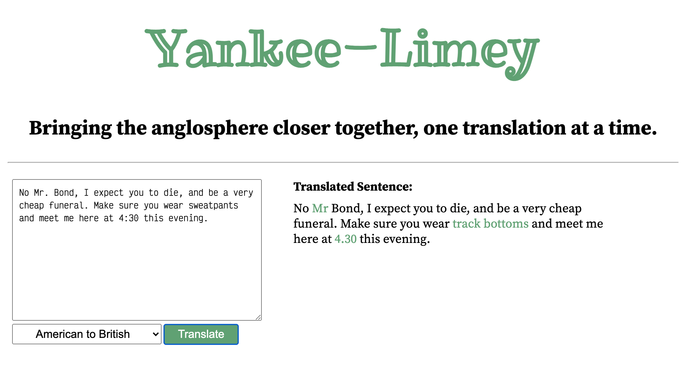

# Yankee-Limey

Yankee-Limey is a translation app to bring the Anglosphere together. Input either American or British style English language and ye shall receive the translation.

Either test the API with the provided text box, or query the API directly with a `POST` request to `/api/translate`.

Yankee-Limey expects both `text` and `locale` to be provided. Locale must be either `american-to-british` or `british-to-american`. Text can be whatever you want.

Created as part of the FreeCodeCamp quality assurance curriculum.